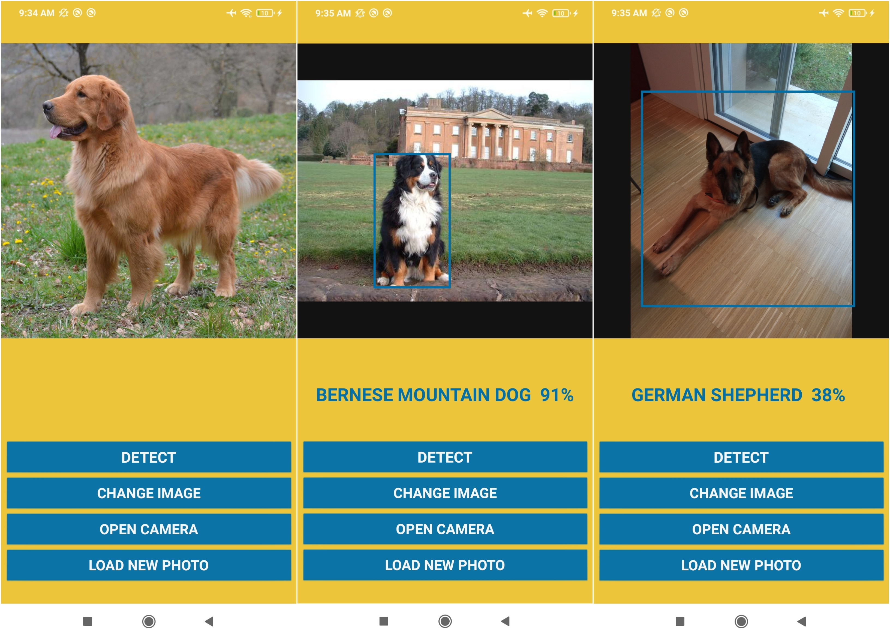

# CanineCam - Predict dogs breeds with YOLOv5 on Android

The goal of this project is to create an Android application capable of recognizing dog breeds using the device's camera. To achieve this objective, several Computer Vision techniques were analyzed, leading to the selection of the YOLOv5 model.

YOLOv5 is a pre-trained model for object detection and image classification, with over 7 million parameters. Through a transfer learning phase, based on Stanford Dogs Dataset found on Kaggle, the model was trained to identify the classes of interest. However, the complexity of the model and the large number of classes to predict proved to be too demanding for the Colab platform used for training. Therefore, we limited the number of classes to 25, which allowed us to utilize the Colab GPU and achieve reasonable accuracy.

### Android app

### CameraX

The project includes the addition of the "CameraController.java" class based on the CameraX API. This class is responsible for opening and closing the camera using specific methods and analyzing the captured image.

### TorchScript on Android

The weights exported from Colab previously need to be placed in the "assets" folder along with a .txt file containing the names associated with the classes. Two important things, not explained by the author on GitHub, are crucial for the code to work correctly:

- The list of class names in the assets folder, in my case, the file "dogs breeds.txt," must have the classes listed in the same order as the "-data" file used during training.
- All custom .ptl and .yaml files should have the same name.

The "PrePostProcessor.java" file should be customized to adapt it to our specific problem by modifying the parameters used during inference.

Finally, using the "ObjectDetectionActivity.java" file and the "run()" method in the MainActivity, we can control the model's behavior and the display of results on the screen.

## YOLOv5 - Transfer learning

You can find my Colab Notebook to train the YOLOv5 model and export it to `torchscript` for Android here:
https://colab.research.google.com/drive/1R8dUxk_8eFu0nkbC6kZvV-lde1X5d5hm?usp=sharing

For a more detailed description about this project read the Project_Description.pdf in this repository.

## Resources

About YOLOv5:

- Documentation YOLOv5: https://docs.ultralytics.com/yolov5/
- YOLOv5 repository: https://github.com/ultralytics/yolov5
- Tutorial YOLOv5: https://colab.research.google.com/github/ultralytics/yolov5/blob/master/tutorial.ipynb
- Tutorial YOLOv5 training: https://docs.ultralytics.com/yolov5/tutorials/train_custom_data/#3-train

About Android ObjectDetection:

- ObjectDetection repository: https://github.com/pytorch/android-demo-app/blob/master/ObjectDetection/
- Use custom weights: https://github.com/pytorch/android-demo-app/tree/master/ObjectDetection#4-update-the-demo-app

Dataset:

- Stanford Dataset: https://www.kaggle.com/datasets/jessicali9530/stanford-dogs-dataset

Useful material:

- Image Preprocessing for Efficient Training of YOLO Deep Learning Networks :
  H. -J. Jeong, K. -S. Park and Y. -G. Ha, ”Image Preprocessing for Efficient Training of YOLO Deep Learning Networks,” 2018 IEEE International Conference on Big Data and Smart Computing (BigComp), Shanghai, China, 2018, pp. 635-637, doi: 10.1109/BigComp.2018.00113.
